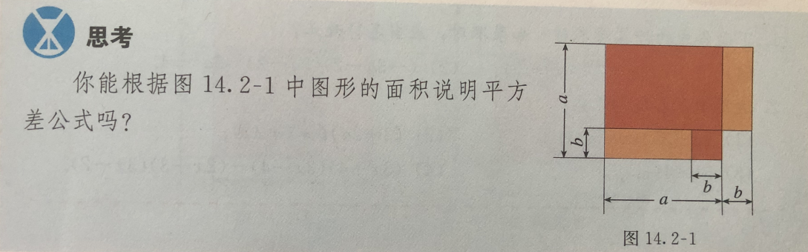
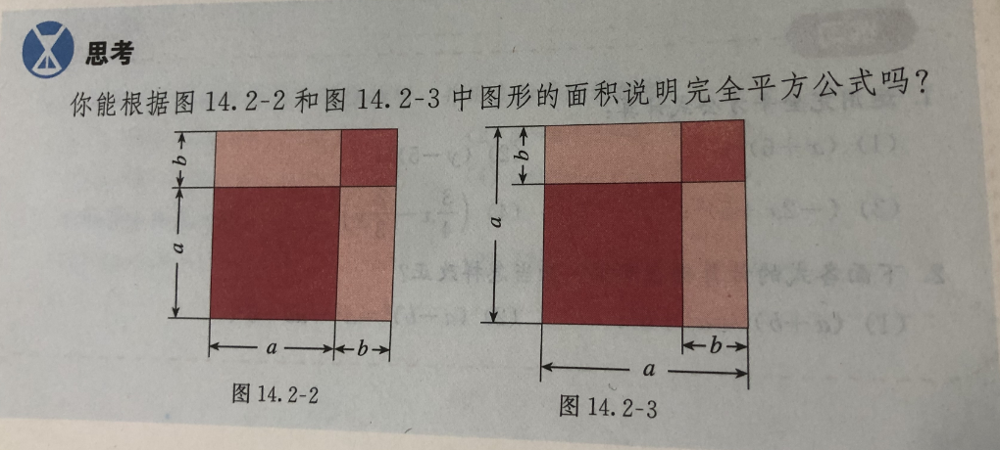
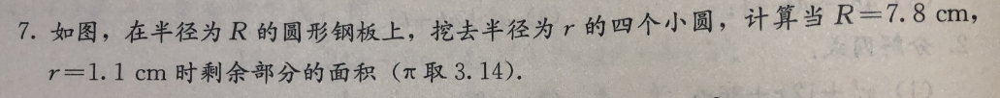
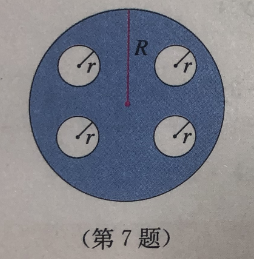

注意事项:
1. 源代码可以看到 Latex 语法.    
2. 使用chrome安装 MathJax plugin for github 可以看到渲染后的内容.  

 
 

# 底数(base)
示例-1   
> $ 10^{15} \times 10^3 $   

在这里, 10就是底数.  

 

示例-2
> $ a^{m} \times a^{n} $

在这里, a 就是底数.  

 
 

# 指数(exponent)  
示例-1  
> $ a^{m} \times a^{n} $  

在这里, m 和 n 都是指数,   
这个示例可以采用 <同底数幂相乘, 底数不变, 指数相加> 原则来简化.  
因此简化后是: $ a^{m+n} $

  

示例-2
> $ (a^{m})^{n} $  

在这里, m 和 n 都是指数,  
这个示例可以采用 <幂的乘方, 底数不变, 指数相乘> 原则来简化.  
因此简化后是: $ a^{mn} $
注意: 幂就是指数, 幂 == 指数.  

 

示例-3  
> $ (ab)^{n} $  

在这里，(ab)是积, n是乘方, 所以被称为<积的乘方>.  
这个示例可以采用: <指数乘以每个因式, 再把所有的结果相乘> 原则来简化.  
因此简化后是: $ a^{n}b^{n} $  

 
 

# 系数(coefficient)
示例-1
> $ 3x $  

在这里, **3** 就是 x 的 **系数**.

 

示例-2
> $ ac^{5} \cdot bc^{2} $  

$ ac^{5} $ 是一个单项式, **a** 是这个单项式的 **系数**.  
$ bc^{2} $ 是一个单项式, **b** 是这个单项式的 **系数**.  

 
 

# 单项式(monomial)  
单项式是一个或多个字母的乘积的组合.  

示例-1
> 7  

单个数字可以构成一个单项式.  

   

示例-2
> 2x^3  

系数、变量、指数的乘积可以构成一个单项式.  

 
 

# 多项式(polynomial)

多项式是多个单项式的和或差组成的表达式.  

示例-1
> $ P(x) = 3x + 2 $

在这里, P(x) 就是一个多项式.

 
 

# 因子(factor)  
**因子** 是指能够整除给定数而不产生余数的数.  

示例-1
> $ 12 = 2 \times 2 \times 3 $  

在这里, **2** 可以整除 12 而不产生余数, 因此 **2** 是12的 **因子**;  
同样的, **3** 可以整除 12 而不产生余数, 因此 **3** 是12的 **因子**;  

 
 

# 因式(factor)
**因式** 是指一个表达式中的一个部分，它可以整除原始表达式.  

示例-1 
> $ 6x^{2} + 9x $  
>
> 可分解为    
> 
> $ 3x(2x^{2} + 3) $  

在这里, 3x 是简化后的表达式的一个 **因式**, 因为它可以整除原始表达式.  
同样的, $ (2x^{2} + 3) $ 也是简化后的表达式的一个 **因式**, 因为它也可以整除原始表达式.  

 
 

# 平方差公式
两个数的和 与 这两个数的差 的 积, 就是平方差公式(formula for the difference of squares).  

示例-1
> $ \quad (a + b)(a - b) \qquad \quad \quad 原表达式 $  
> $ = a^2 - ab + ab - b^2 \qquad \quad 计算过程 $   
> $ = a^2 - b^2  \qquad \qquad \qquad \quad 结果$

 

示例-2  

在几何学方案, 计算图形间得差异，通常指的是面积差。  
计算面积差采用平方差公式，即: 用较大的面积 - 较小的面积。  
较大的面积: $ a^2 $  
较小的面积: $ b^2 $   
面积差: $ a^2 - b^2 $

 
 

# 完全平方公式
两个数的和的平方，等于它们的平方和，加上它们的积的2倍。
> $ (a + b)^2 = a^2 + 2ab + b^2 $

 

两个数的差的平方，等于它们的平方，减去它们的积的2倍。
> $ (a - b)^2 = a^2 - 2ab + b^2 $  

 

示例-1

左图  
左下角的正方形: $ \qquad a^2 $  
右上角的正方形: $ \qquad b^2 $  
左上角的长方形: $ \qquad ab $  
右下角的长方形: $ \qquad ab $  
全部加起来得出: $ \qquad a^2 + 2ab + b^2 $  
逆向推导可得出: $ \qquad (a + b)(a + b) $  
逆向推导可得出: $ \qquad (a + b)^2  $  

右图  
由于a包含了b，所以不能像左图那样使用 $ (a + b)^2 $ 来说明完全平方公式.    
但是可以使用完全平方公式来表示右图中左下角的小正方形.    
左侧边长: $ \qquad \quad a - b $  
底部边长: $ \qquad \quad a - b $  
边长乘以边长: $ \quad (a - b)(a - b) $  
逆向推导得出: $ \quad (a - b)^2 $  

备注：  
"平方差"和"完全平方差"在数学中有着广泛的应用。  
在代数学方面，平方差公式常用于因式分解、简化表达式、求解方程。  
在几何学方面，平方差公式常用于计算几何图形的面积和长度、以及长度差异的问题。  
在统计学方面，完全平方差用于方差分析和标准差计算，有助于理解数据集的分散程度。  
在物理学方面，平方差常用于动能和势能的计算。  
在经济学和金融学方面，在分析风险和收益时，它们用于测量波动性和预测模型的精确度。

 
 

# 因式分解(factorization)  
把一个多项式转换成几个整式的积的形式，叫做这个多项式的因式分解.  

    

示例-1: 介绍     
等号左边是多项式, 等号右边是这个多项式的因式分解.    

> $ x^2 + x = x(x + 1) $  

 

示例-2: 提公因式法  
使用公因式法来转换成因式分解,  
公因式指的是提取每个多项式中相同的部分.  
> $ pa + pb + pc = p(a + b + c) $  

 

示例-3: 公式法  
基于上面的 "平方差公式"、"完全平方公式" 来转换成因式分解.  

> 平方差公式: $ \qquad \quad a^2 - b^2 = (a + b)(a - b) $  
>  
> 完全平方差公式： $ \quad a^2 + 2ab + b^2 = (a + b)(a + b) = (a + b)^2 $  
> 
> 完全平方差公式： $ \quad a^2 - 2ab + b^2 = (a - b)(a - b) = (a - b)^2 $  

备注：  
像完全平方差公式中的 $ (a + b)(a + b) $ 和 $ (a + b)^2 $ 都是因式分解.  

 

示例-4: 十字相乘法  
适用于分解 <一元二次三项式> , 例如: $ x^2 + 7x -8 $ .  
一元: 多项式中只能包含一个未知数, 这里指的是 x.  
二次: 多项式中未知数的次数最高是2, 这里指的是 ^2.  
三项式: 多项式由三个单项式组成.  

将二次项的常数分解得到 1 * 1.  
将常数项分解得到 -1 * 8.  
按竖式排列, 然后交叉相乘.  
1  -1  
1   8  
得到: 8 和 -1
最后转换成两个一次项的乘积  
(x + 8)(x - 1)

 

示例-5  

  
  

> $ \quad 2\pi R  - 4\cdot(2\pi r)  \qquad 多项式$  
> $ = 2\pi R  - 8\pi r \qquad \qquad 多项式$  
> $ = 2\pi \cdot (R - 4r) \qquad \quad 因式分解 $   
> $ = 6.28 \cdot (7.8 - 4.4) \quad 将数值代入并计算结果 $   
> $ = 6.28 * 3.4 $  
> $ = 21.352 $

 
 

# 分式  
与分数形式相同，区别是分式的分母必须要由字母组成, 例如: $ \frac{90}{30+v} $   
分式的作用主要是培养数学思维.

示例-1  
一艘轮船在静水中的最大航速为 30km/h, 它以最大航速沿江顺流航行90km所用时间, 与以最大航速逆流航行60km所用时间相等，江水的流速是多少?    

物理公式: $ \qquad 时间 = \frac{里程数}{速度} $  
假设流速是: x km/h  
顺流 > 静水, 所以速度应该采用 (30 + x) km/h  
逆流 < 静水, 所以速度应该采用 (30 - x) km/h    
已知顺流里程数是 90km, 和 速度 (30 + x)km/h , 所以 <时间> 可以使用分式来表达: $ \frac{90}{30+x} $   
已知逆流里程数是 60km, 和 速度 (30 - x)km/h , 所以 <时间> 可以使用分式来表达: $ \frac{60}{30-x} $   
题目中还提到它们两的时间相等, 因此可以表示为:   
$原式子: \qquad \frac{90}{30+x} = \frac{60}{30-x} $   
$交叉相乘: \quad 90(30-x) = 60(30+x) $  
$展开: \qquad \quad 2700-90x = 1800 + 60x $  
$移项: \qquad \quad -90x - 60x = 1800 - 2700 $  
$计算: \qquad \quad -150x = -900 $  
$计算: \qquad \quad x = \frac{-900}{-150} $  
$结果： \qquad \quad x = 6$  
